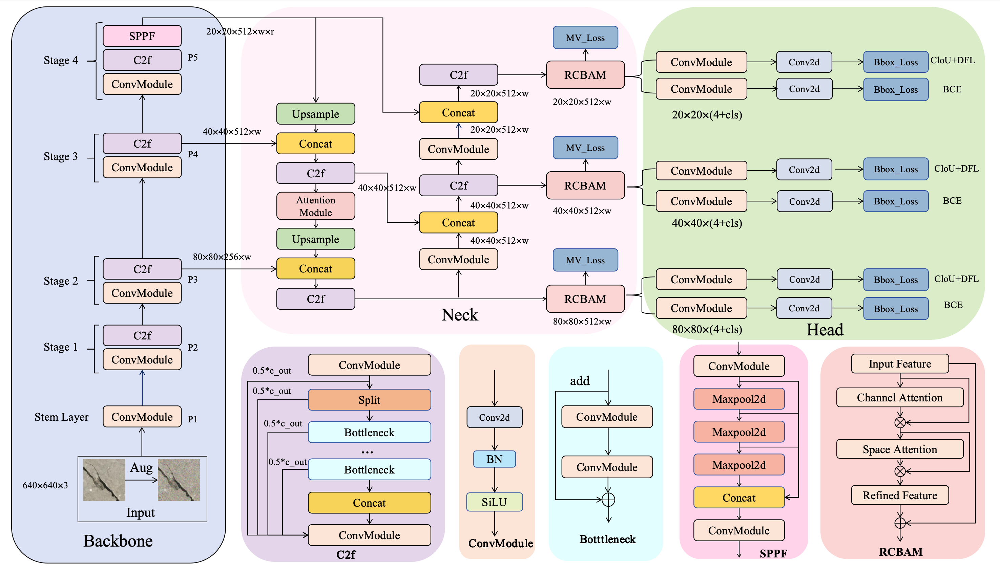

# 基于 YOLOv8 的自监督注意力引导的轻量级智能裂缝检测系统

## 项目概述

本项目研究基于 YOLOv8 的裂缝检测模型在退化图像条件（噪声、模糊）下的鲁棒性，并对标准 YOLOv8n 架构进行了以下扩展：

- **自定义注意力模块** RCBAM
- **数据退化流水线**：可配置比例的高斯噪声和高斯模糊
- **自监督一致性损失**：多视角（Multi-view）一致性损失
- **半监督训练**：伪标签 + EMA 教师模型框架（可选）

## 方法概览

下图展示了本项目的整体框架。系统以 YOLOv8n 为基线模型，集成了三个核心改进模块：**RCBAM 注意力模块**嵌入检测头的多尺度特征层以增强裂缝区域的特征表达；**数据增强策略**通过引入高斯噪声和运动模糊的退化图像来扩充训练样本多样性；**Multi-view 一致性自监督损失**利用双视角特征对齐提升模型在退化条件下的鲁棒性。三者协同作用，显著提升了裂缝检测在复杂环境下的精度和泛化能力。



## 项目结构

```
YOLOv8-Crack-Detection/
├── train.py                        # 训练脚本（支持监督训练 & 半监督训练）
├── test.py                         # 在多个退化测试集上进行批量评估
├── single_image_test.py            # 单张图片推理与可视化
├── batch_image_test.py             # 批量图片评估与网格可视化
├── aug.py                          # 图像退化工具（高斯噪声 & 运动模糊）
├── generate_degraded_datasets.py   # 生成退化训练数据集
├── generate_degraded_testsets.py   # 按不同退化程度生成退化测试集
├── training_cracks/
│   ├── DawgSurfaceCracks/          # 干净训练数据集（YOLO 格式）
│   └── degraded_dataset/           # 退化训练数据集
├── test_datasets/
│   ├── clean/                      # 干净测试集
│   ├── noise_{x}_percent/          # 噪声测试集（2.5% ~ 30%）
│   └── blur_{x}_percent/           # 模糊测试集（2.5% ~ 30%）
├── ultralytics/                    # 本地 ultralytics 包（已自定义修改）
│   └── cfg/models/v8/
│       ├── yolov8.yaml             # 标准 YOLOv8 配置
│       ├── yolov8_RCBAM.yaml
├── yolov8n.pt                      # YOLOv8n 预训练权重
├── yolo26n.pt                      # YOLOv26n 预训练权重
└── LICENSE                         # MIT 许可证
```

## 数据集

本项目使用 Roboflow 上的 **DawgSurfaceCracks** 数据集：

- **来源**：[Roboflow Universe - DawgSurfaceCracks v3](https://universe.roboflow.com/xplodingdog/dawgsurfacecracks/dataset/3)
- **类别**：1 类（`SurfaceCrack`，表面裂缝）
- **标注格式**：YOLO 格式（边界框 & 多边形标注）
- **许可证**：CC BY 4.0

## 安装

1. 克隆仓库：
   ```bash
   git clone https://github.com/Zhan-QI-A11Y/YOLOV8_Attention_Crack_Detection
   cd YOLOV8_Attention_Crack_Detection
   ```

2. 安装依赖：
   ```bash
   pip install opencv-python matplotlib numpy pyyaml
   ```

## 使用方法

### 训练

**标准监督训练**（使用 RCBAM 注意力模块）：
```bash
python train.py --attention RCBAM --epochs 50 --lr 0.01 --batch 16 --name my_experiment
```

**启用自监督一致性损失**：
```bash
python train.py --attention RCBAM --epochs 50 \
    --multi_view 0.1 \
    --name experiment_with_losses
```

**半监督训练**（伪标签 + EMA 教师模型）：
```bash
python train.py --semi --unlabeled_dir /path/to/unlabeled/images \
    --semi_rounds 2 --semi_conf 0.7 --attention RCBAM
```


### 训练参数说明

| 参数 | 默认值 | 说明 |
|------|--------|------|
| `--dataset` | `training_cracks/DawgSurfaceCracks/data.yaml` | 数据集配置文件路径 |
| `--epochs` | `50` | 训练轮数 |
| `--model` | 由 `--attention` 决定 | 预训练权重或模型配置文件 |
| `--attention` | `RCBAM` | 注意力模块选择 |
| `--lr` | `0.01` | 初始学习率 |
| `--batch` | `16` | 批量大小 |
| `--multi_view` | `0.1` | 多视角一致性损失权重（>0 启用） |

### 评估

**在所有退化测试集上评估**（干净 + 噪声 + 模糊）：
```bash
python test.py --model results_attention/clean_data_RCBAM/weights/best.pt \
    --attention RCBAM --name-prefix eval_clean_data_RCBAM
```

评估结果将保存为 CSV 文件，包含每个测试集的 Precision（精确率）、Recall（召回率）、F1-Score、mAP50 和 mAP50-95 指标，以及简单平均和加权平均汇总。

### 单张图片可视化

生成三面板对比图：**原始图像 | 真实标注 | 模型预测**。
```bash
python single_image_test.py --model results_attention/clean_data_RCBAM/weights/best.pt \
    --index 20 --conf 0.1
```

### 批量图片可视化

以网格布局评估多张图片，并生成置信度分布分析图：
```bash
python batch_image_test.py --model results_attention/clean_data_RCBAM/weights/best.pt \
    --num-samples 9 --conf 0.1
```

### 生成退化数据集

**生成退化训练数据**（1/3 模糊、1/3 噪声、1/3 原图）：
```bash
python generate_degraded_datasets.py
```

**按不同退化程度生成退化测试集**：
```bash
python generate_degraded_testsets.py
# 交互式输入：选择模式（noise/blur）和退化百分比
```

### 图像退化工具

`aug.py` 提供单张图像退化功能，支持：
- **高斯噪声**：可配置均值和标准差
- **运动模糊**：可配置核大小和角度

```bash
python aug.py
```

## 核心特性

### 注意力机制（RCBAM）

RCBAM 模块被嵌入到 YOLOv8 检测头的 P3、P4、P5 特征层级，结合了：
- **通道注意力**：捕获通道间的特征依赖关系
- **空间注意力**：突出空间上相关的区域
- **残差连接**：保留梯度流和原始特征信息

### 自监督一致性损失

自监督辅助损失可用于提升特征鲁棒性：
- **多视角一致性**（`--multi_view`）：使用双视角余弦距离进行特征对齐

### 半监督训练

基于伪标签 + EMA 教师模型的半监督学习框架：
1. **第 0 轮**：在有标注数据上进行监督预热训练
2. **第 1~N 轮**：使用教师模型对无标注图像生成伪标签，将伪标签数据与有标注数据合并后继续训练
3. 支持配置自训练轮数（`--semi_rounds`）、伪标签置信度阈值（`--semi_conf`）等

### 鲁棒性评估

评估流水线系统性地测试模型在以下条件下的表现：
- **高斯噪声**：2.5%、5%、10%、15%、20%、25%、30%
- **高斯模糊**：2.5%、10%、15%、20%、25%、30%
- **干净**（未修改）图像

评估指标包括：Precision、Recall、F1-Score、mAP50、mAP50-95

## 实验结果

### 总实验

| Recall | Precision | F1-Score | AP50 | mAP |
|--------|-----------|----------|------|-----|
| 0.719 | 0.783 | 0.749 | 0.783 | 0.447 |


### 消融实验

| baseline | RCBAM | 数据增强 | 一致性自监督 | AP50 | mAP |
|:--------:|:-----:|:--------:|:----------:|------|-----|
| ✅ | | | | 0.749 | 0.391 |
| ✅ | ✅ | | | 0.753 | 0.413 |
| ✅ | ✅ | ✅ | | 0.781 | 0.446 |
| ✅ | ✅ | ✅ | ✅ | 0.783 | 0.447 |


## 许可证

本项目基于 MIT 许可证开源 — 详见 [LICENSE](LICENSE)。

原始版权 © 2026 Zhan-QI-A11Y。
